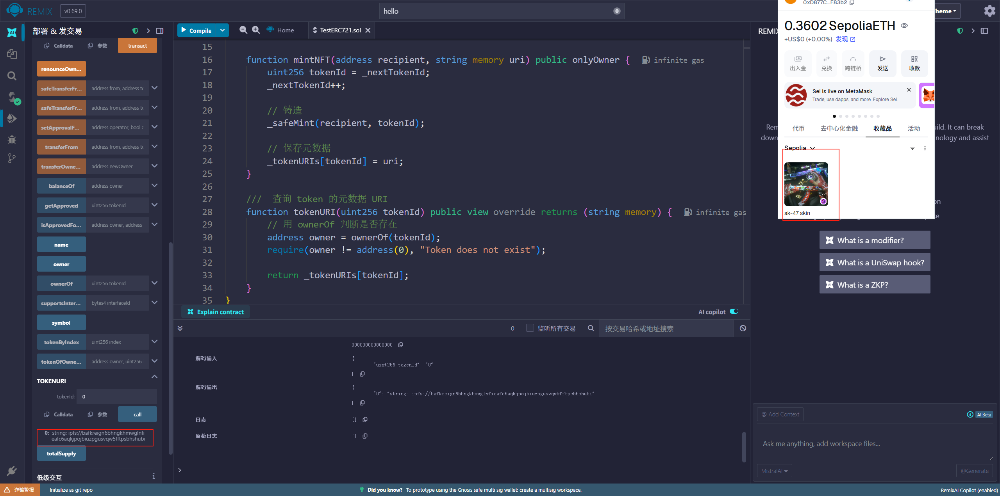
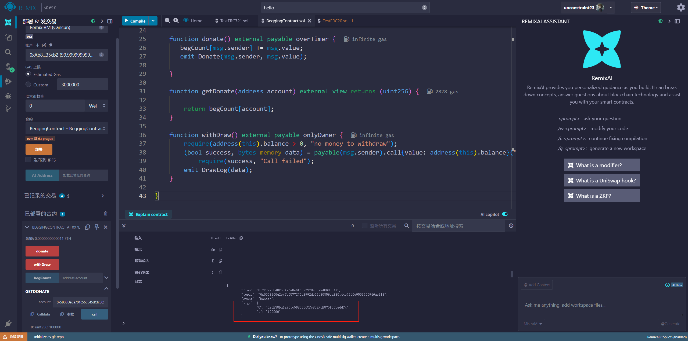
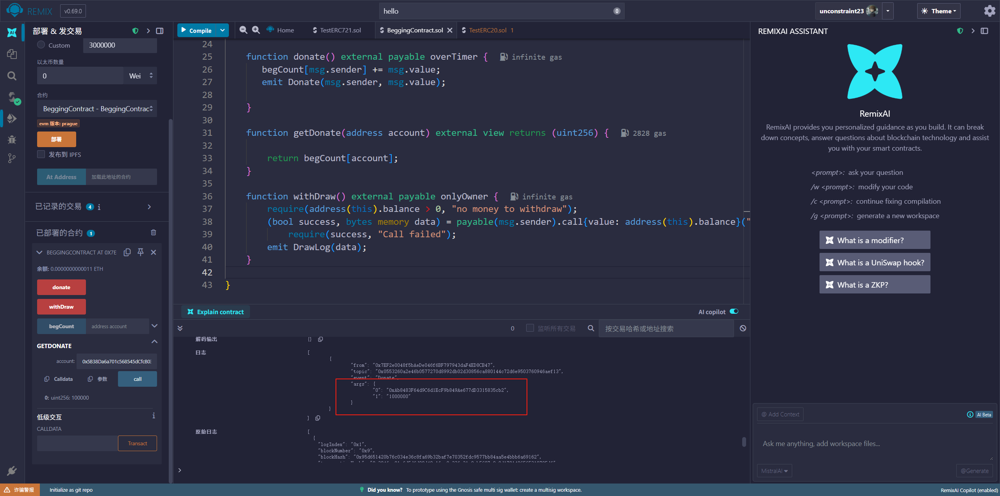
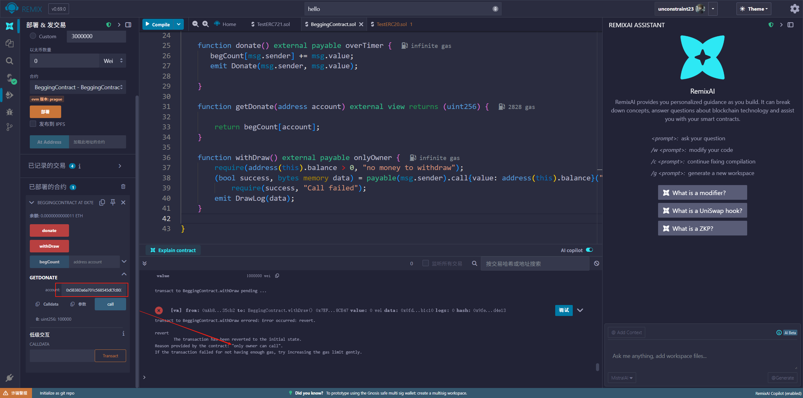

### ERC721调试图

### 讨饭合约调试图

实现功能：
    1. 一个 mapping 来记录每个捐赠者的捐赠金额。
    2. 一个 donate 函数，允许用户向合约发送以太币，并记录捐赠信息。
    3. 一个 withdraw 函数，允许合约所有者提取所有资金。
    4. 一个 getDonation 函数，允许查询某个地址的捐赠金额。
    5. 使用 payable 修饰符和 address.transfer 实现支付和提款。
    6. 捐赠事件：添加 Donation 事件，记录每次捐赠的地址和金额。
    7. 时间限制：添加一个时间限制，只有在特定时间段内才能捐赠。

